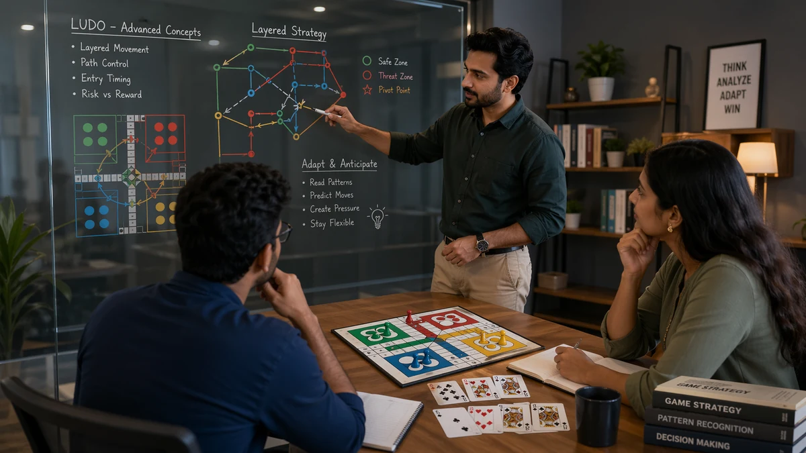

# Ludo and Teen Patti Advanced Concepts

## 🪶 Introduction

Advanced concepts only help when your basic decisions are already stable. Otherwise they become decoration: interesting to read, difficult to apply, and easy to misuse. This page is for players who already understand the routine layers of play and want to see how stronger players connect several ideas at once.

The key here is maturity. Advanced play is rarely about showing off. It is about understanding deeper consequences earlier than your opponent does.

---

## 🖼️ Advanced Concepts Overview

---

## 🎯 What Makes a Concept Advanced?

An idea becomes advanced when it relies on timing, indirect value, or multi-step consequences that are easy to miss in real time. In Ludo, this can mean shaping future routes rather than maximizing the current roll. In Teen Patti, it can mean understanding how table image, prior action, and future pressure interact.

These ideas are useful, but only if you can still explain them in plain language. If a concept sounds smart but does not change actual decisions, it is probably not helping yet.

---

# 🧠 1. Planning Beyond the Current Turn

Newer players often think move by move. Stronger players think in short sequences. They ask what this decision creates two turns from now, not only what it achieves immediately.

That mindset is one of the biggest jumps in skill because it changes how you value safety, initiative, and flexibility.

# 🧠 2. Indirect Pressure

Not every strong action is direct. Sometimes you improve because your move changes what the opponent is comfortable doing next. In Ludo, a token placement can make future lanes awkward. In Teen Patti, a measured response can make later pressure more credible.

Indirect pressure is advanced because it wins value without always looking dramatic in the moment.

# 🧠 3. Information Through Behavior

Experienced players gather information from decisions, timing, hesitation, and repeated patterns. They do not rely on one tell or one clue. They accumulate behavior over time and update their read carefully.

This is important in both games because information is often partial. The player who interprets partial information more calmly usually gains the edge.

# 🧠 4. Flexible Value

Some resources become more or less valuable depending on the game state. A safe square in Ludo can be far more valuable when your board is stretched. Table position in Teen Patti can matter much more when the action pattern becomes unstable.

Advanced players do not assign static value to everything. They ask what this resource is worth in this version of the game.

# 🧠 5. Controlled Deception

At higher levels, opponents also read patterns. That means predictable behavior can be exploited. Controlled deception is the art of occasionally choosing a line that keeps you from becoming too easy to map, without abandoning solid fundamentals.

This concept should be used carefully. Many players try to be unpredictable before they learn to be sound. That order should be reversed.

# 🧠 6. Layered Review

Advanced players review hands and turns in layers. First they check the fundamental mistake. Then they examine timing. Then they ask whether a deeper strategic idea was available. This prevents overcomplication.

If you skip the early layers and jump straight to fancy analysis, you usually miss the actual leak.

# 🧠 7. Knowing When Not to Apply Advanced Ideas

This may be the most advanced habit of all. Not every spot deserves deep complexity. If the fundamental answer is already strong, forcing a cleverer answer can make the game worse, not better.

Good advanced play includes the discipline to stay simple when simple is enough.

---

## ⚠️ Common Mistakes

- Reaching for advanced ideas before fundamentals are reliable.
- Confusing complexity with quality.
- Using indirect pressure without understanding the follow-up.
- Trying to be deceptive instead of trying to be sound.
- Ignoring the simple mistake because the advanced idea feels more interesting.

---

## 🧾 Summary

Ludo and Teen Patti advanced concepts matter when they help you see future value, indirect pressure, and changing resource importance more clearly. They are not a replacement for fundamentals. They are what grows naturally once your baseline decisions are already disciplined.

---

## 🔍 SEO Keywords

ludo and teen patti advanced concepts
advanced strategic gameplay
multi-step game planning
indirect pressure strategy
high-level player guide

---

## Related Pages

- [Ludo and Teen Patti Game Awareness](./game-awareness.md)
- [Ludo and Teen Patti Pattern Recognition](./pattern-recognition.md)
- [Ludo and Teen Patti Scenarios](./scenarios.md)
- [Ludo and Teen Patti Strategic Thinking](./strategic-thinking.md)
